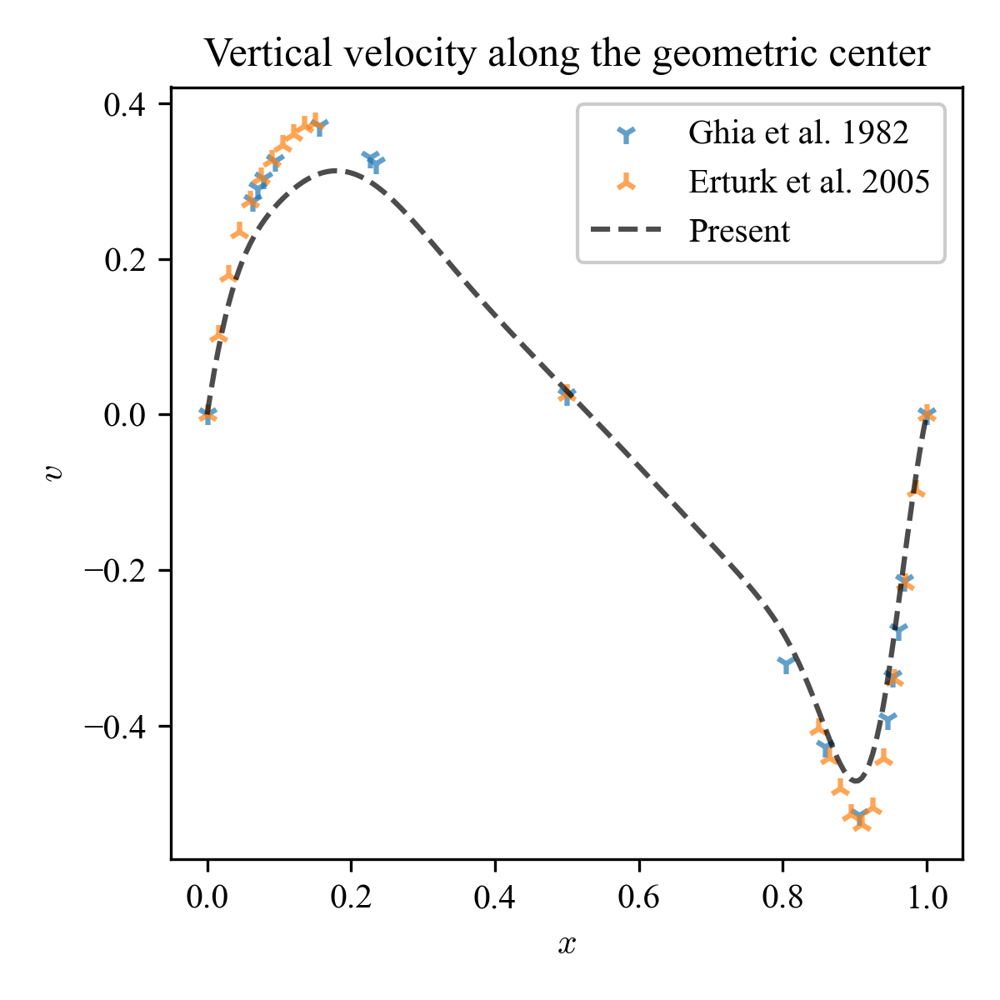
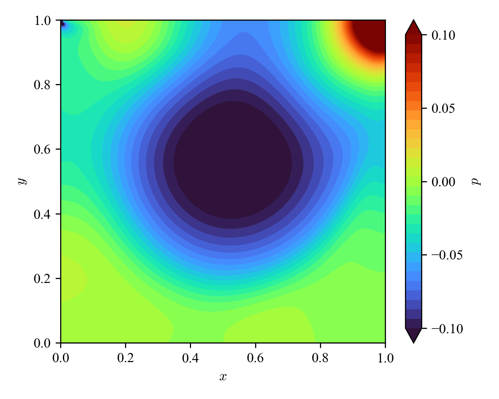
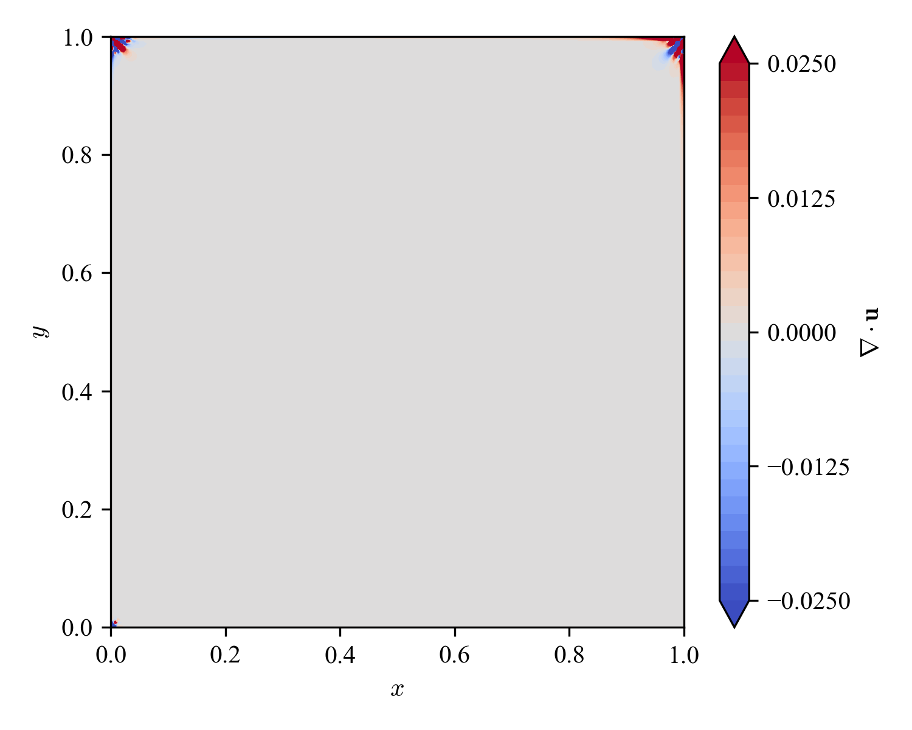

# Cavity_FDM_NumPy2

Updated version of [Cavity_FDM_NumPy](https://github.com/ShotaDeguchi/Cavity_FDM_NumPy)

For a mathematical understanding of finite difference methods, a great resource can be found [here](https://folk.ntnu.no/leifh/teaching/tkt4140/._main000.html). 

You can also play around [here](https://colab.research.google.com/drive/1FMbHcdwEEk9EOBMe0IaooWNMtKP-7_zk?usp=sharing). 

See `01_Arakawa_B/04_Kawamura_Kuwahara/main.py` for the clean implementation. 

## Results
Cavity flow is a steady state problem. Consider that the field has reached its steady state when the following condition is satisfied:
```math
\max \left( \frac{\| u^{(n+1)} - u^{(n)} \|_2}{\| u^{(n)} \|_2}, \frac{\| v^{(n+1)} - v^{(n)} \|_2}{\| v^{(n)} \|_2} \right) \le \delta
```
where $\delta$ is the convergence tolerance, set to $\delta = 10^{-8}$. 

| Column name | Description | 
| :---: | :--- |
| vel | velocity norm |
| prs | pressure (shifted so its mean value is zero) |
| div | velocity divergence (ideally, zero everywhere) |
| vor | vorticity |
| u | Horizontal velocity along the geometric center |
| v | Vertical velocity along the geometric center |

### Same grid (Arakawa-B), different schemes
To illustrate the difference due to spatial schemes for convection (2nd order central difference is used for pressure gradient and diffusion), we first present the results obtained with different schemes using the same grid system (here Arakawa-B). The Reynolds number is set to 1,000. 

| Convection | vel | prs | div | vor | u | v |
| :--- | :---: | :---: | :---: | :---: | :---: | :---: |
| 1st order upwind |  |  |  |  |  |  |
| Lax-Wendroff |  |  |  |  |  |  |
| QUICK |  |  |
| QUICKEST |  |  |
| Kawamura-Kuwahara |  |  |  |  |  |  |

### Same scheme (Kawamura-Kuwahara), different grid
Next, to realize the difference due to the choice of grid system, we now present the results by difference grid while using the same spatial schemes (Kawamura-Kuwahara for convection, central difference for pressure gradient and diffusion). The Reynolds number is set to 1,000. 


The following summarizes the results obtained using different spatial schemes at different Reynolds numbers. 

| Re | t | Velocity norm  | Pressure | u | v |
| :---: | :---: | :---: | :---: | :---: | :---: |
| 100 | 15.4 |  |  |  |  |
| 400 | 26.8 |  |  |  |  |
| 1,000 | 36.4 |  |  |  |  |
| 3,200 | 87.5 |  |  |  |  |
| 5,000 | 148.5 |  |  |  |  |


## License
MIT License
