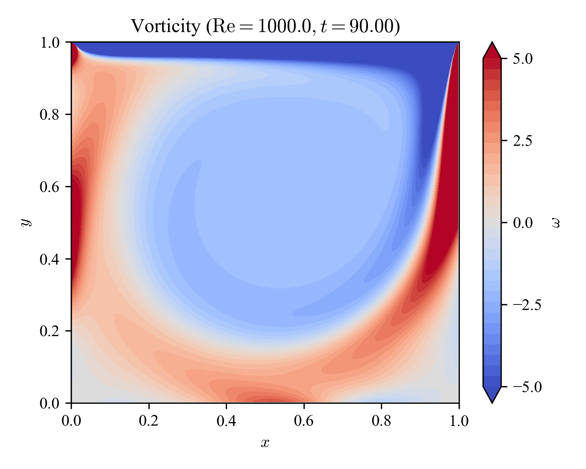
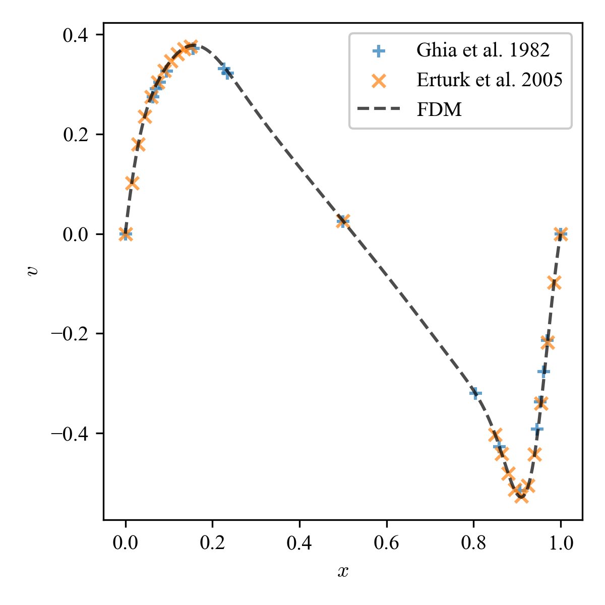
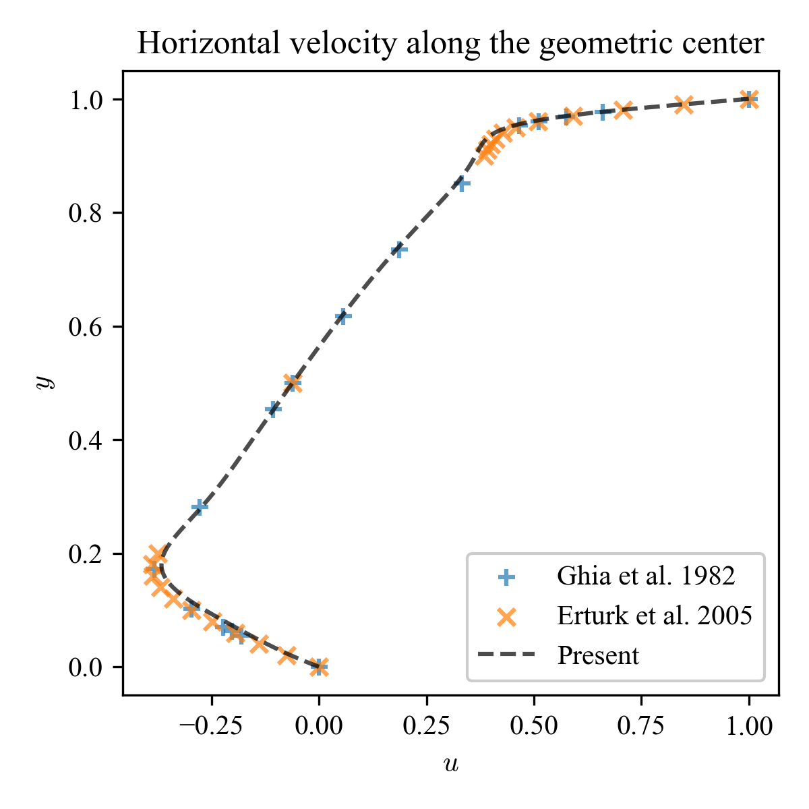

# Cavity_FDM_NumPy2

This is an updated version [Cavity_FDM_NumPy](https://github.com/ShotaDeguchi/Cavity_FDM_NumPy). 

## Problem setup
Lid-driven cavity flow is a fundamental problem in fluid mechanics used to test and validate numerical methods for simulating fluid dynamics, especially in confined spaces. 

An incompressible Newtonian fluid is confined in a square cavity where the top lid is set to move at a constant velocity, inducing flow within the cavity. On the other three sides of the cavity, no-slip boundary conditions are imposed to ensure that the fluid velocity is zero. A homogeneous Neumann boundary condition is imposed on all sides of the wall, i.e. the pressure gradient along the wall is zero (a homogeneous Dirichlet condition is applied at the bottom left corner). 

This repository provides NumPy implementation and comparison of
* different convection schemes
* different grid systems
which are often used in the finite difference method.

For a mathematical understanding of finite difference methods, a great resource can be found [here](https://folk.ntnu.no/leifh/teaching/tkt4140/._main000.html). 

You can also play around [here](https://colab.research.google.com/drive/1FMbHcdwEEk9EOBMe0IaooWNMtKP-7_zk?usp=sharing). 

## Method
### Governing equation
The governing equations are the incompressible Navier-Stokes equations (dimensionless form):
```math
\begin{align}
  \nabla \cdot \mathbf{u} &= 0 \\
  \frac{\partial \mathbf{u}}{\partial t}
  + \left( \mathbf{u} \cdot \nabla \right) \mathbf{u}
  &= - \nabla p + \frac{1}{\mathrm{Re}} \nabla^2 \mathbf{u}
\end{align}
```
where $\mathbf{u}$ is the velocity, $p$ is the pressure, and $\mathrm{Re}$ is the Reynolds number (ratio of inertia vs viscosity), respectively (external source is removed). 

### Discretization - temporal direction
We employ Chorin's projection method (Chorin1968), i.e. split 1 timestep into *prediction* and *correction* steps:
```math
\begin{align}
  \frac{\mathbf{u}^{(*)} - \mathbf{u}^{(n)}}{\Delta t} &= - \left( \mathbf{u}^{(n)} \cdot \nabla \right) \mathbf{u}^{(n)} + \frac{1}{\mathrm{Re}} \nabla^2 \mathbf{u}^{(n)} \\
  \frac{\mathbf{u}^{(n+1)} - \mathbf{u}^{(*)}}{\Delta t} &= - \nabla p^{(n+1)}
\end{align}
```
where the intermediate velocity field, $\mathbf{u}^{(*)}$, is introduced. Enforcing the continuity at the next timestep yields the following pressure Poisson equation: 
```math
\begin{align}
  \nabla \cdot \left( \frac{\mathbf{u}^{(n+1)} - \mathbf{u}^{(*)}}{\Delta t} \right) &= - \nabla \cdot \nabla p^{(n+1)} \\
  \nabla^2 p^{(n+1)} &= \frac{ \nabla \cdot \mathbf{u}^{(*)}}{\Delta t}
\end{align}
```
In summary, time marching is performed in the following manner:
1. Get the intermediate velocity field: $\mathbf{u}^{(*)} = \mathbf{u}^{(n)} + \Delta t \left( - \left( \mathbf{u}^{(n)} \cdot \nabla \right) \mathbf{u}^{(n)} + \nabla^2 \mathbf{u}^{(n)} / \mathrm{Re} \right)$
2. Solve for the next pressure field: $\nabla^2 p^{(n+1)} = \nabla \cdot \mathbf{u}^{(*)} / \Delta t$
3. Get the next velocity field: $\mathbf{u}^{(n+1)} = \mathbf{u}^{(*)} + \Delta t \left( - \nabla p^{(n+1)} \right)$

### Discretization - spatial direction
Kuwahara-Kawamura scheme uses 5-point stencil along 1 axis. Considering the sign of convective velocity, we have:
```math
  c \frac{\partial \phi}{\partial x} \approx
    \begin{cases}
      c \left( 2 \phi_{i+1} + 3 \phi_{i} - 6 \phi_{i-1} +   \phi_{i-2} \right) / \left( 6 \Delta x \right) & \text{if $c \ge 0$} \\
      c \left( - \phi_{i+2} + 6 \phi_{i+1} - 3 \phi_{i} - 2 \phi_{i-1} \right) / \left( 6 \Delta x \right) & \text{if $c \lt 0$}
    \end{cases}
```
Using the relation of $c = \left( c + |c| \right) / 2 + \left( c - |c| \right) / 2 $, we get:
```math
  c \frac{\partial \phi}{\partial x} \approx
  c \frac{- \phi_{i+2} + 8 \phi_{i+1} - 8 \phi_{i-1} + \phi_{i-2}}{12 \Delta x} - \beta |c| \left( \Delta x \right)^3 \frac{\phi_{i+2} - 4 \phi_{i+1} + 6 \phi_{i} - 4 \phi_{i-1} + \phi_{i-2}}{\left( \Delta x \right)^4}
```
where $\beta$ controls the intensity of the numerical diffusion, and is chosen as $\beta = 1 / 4$ in Kuwahara-Kawamura scheme. 

For pressure gradient and diffusion, we simply applied the 2nd order central difference scheme. 

Gradient:
```math
  \frac{\partial \phi}{\partial x} \approx \frac{\phi_{i+1} - \phi_{i-1}}{2 \Delta x}
```

Diffusion:
```math
  \frac{\partial^2 \phi}{\partial x^2} \approx \frac{\phi_{i+1} - 2 \phi_{i} + \phi_{i-1}}{\Delta x^2}
```

### Dimensional analysis
We denote the characteristic length as $L$ and the characteristic velocity as $U$, and the Kolmogorov length scale $\eta$ is given as:
```math
\eta \sim \mathcal{O} \left[ \frac{\nu^{3/4}}{\epsilon^{1/4}} \right]
```
where $\nu$ is the kinematic viscosity, and $\epsilon$ is the dissipation rate of turbulence kinetic energy. We can interpret $\eta$ as energy dissipation scale. Meanwhile, energy supply scale is given by:
```math
L \sim \mathcal{O} \left[ \frac{U^{3}}{\epsilon} \right]
```
and therefore,
```math
\frac{L}{\eta} \sim \mathcal{O} \left[ \mathrm{Re}^{3/4} \right]
```
If $\mathrm{Re} = 1,000$, $L / \eta \approx 180$, i.e. roughly speaking, $180$ grid points are needed along one axis (or $\Delta x \approx 1 / 180 \approx 5.5 \times 10^{-3}$). The number of grid points required grows rapidly as the spatial dimensions increase. In the following section, the Reynolds number is chosen as $\mathrm{Re} = 1,000$ and we choose $\Delta x = 5 \times 10^{-3}$ to (almost) fully resolve the eddies and avoid introducing the large eddy models. 

## Results
Cavity flow is a steady state problem. We assume that the field has reached its steady state when the following condition is satisfied:
```math
\left( \frac{\sum_{i, j} | u^{(n+1)}_{i,j} - u^{(n)}_{i,j} |^2}{\sum_{i, j} | u^{(n)}_{i,j} |^2} \right)^{1/2} \le \delta
```
where $\delta$ is the convergence tolerance, set to $\delta = 10^{-8}$. 

Following quantities are presented:
| Column name | Description | 
| :---: | :--- |
| vel | Velocity norm |
| prs | Pressure (shifted so its mean value is zero) |
| div | Velocity divergence (ideally, zero everywhere) |
| vor | Vorticity |
| u | Horizontal velocity along the geometric center |
| v | Vertical velocity along the geometric center |

*Horizontal / vertical velocity along the geometric center is compared against compared with [Ghia+1982](https://doi.org/10.1016/0021-9991(82)90058-4) and [Erturk+2005](https://doi.org/10.1002/fld.953).*

### Comparison of different convection schemes (using the same grid system)
To illustrate the difference due to spatial schemes for convection (2nd order central difference is used for pressure gradient and diffusion), we first present the results obtained with different schemes using the same grid system (here Arakawa-B). The Reynolds number is set to $\mathrm{Re} = 1,000$ and the spatial resolution is $\Delta x = 5 \times 10^{-3}$. 

| Scheme | vel | prs | vor | u | v |
| :--- | :---: | :---: | :---: | :---: | :---: |
| 1st order upwind |  |  |  |  |  |
| Lax-Wendroff |  |  |  |  |  |
| QUICK |  |  |  |  |  |
| QUICKEST |  |  |  |  |  |
| Kawamura-Kuwahara |  |  |  |  |  |

### Comparison of different grid systems (using the same convection scheme)
Next, to realize the difference due to the choice of grid system, we now present the results by difference grid while using the same spatial schemes (Kawamura-Kuwahara for convection, central difference for pressure gradient and diffusion). The Reynolds number is set to $\mathrm{Re} = 1,000$ and the spatial resolution is $\Delta x = 5 \times 10^{-3}$. 

| Grid | vel | prs | div | u | v |
| :--- | :---: | :---: | :---: | :---: | :---: |
| Arakawa-A |  |  |  |  |  |
| Arakawa-B |  |  |  |  |  |
| Arakawa-C |  |  |  |  |  |

## License
MIT License
